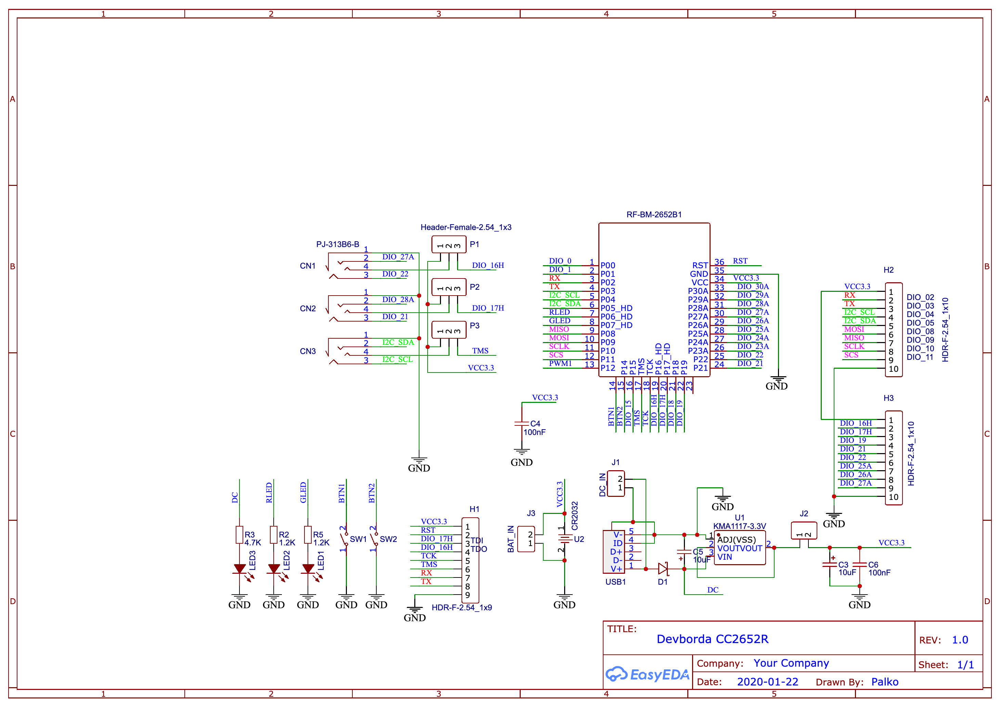

# Hardware

# How to add device into zigbe2mqtt
Use [external converters](https://www.zigbee2mqtt.io/information/configuration.html#external-converters-configuration) feature

Converter file located [here](./DIYRuZ_SensBoard.js)

# UI

`BTN-1`: Starts the commissioning process.

`BTN-2`: If hold after reset, perform Factory New reset (erase network and application persistent data `zclGenericApp_RemoveAppNvmData`)

`BTN-2`: Reset the application to factory new state.

# Buttons

`BTN-1` -> `DIO13`

`BTN-2`-> `DIO14`

# All pins are pulled up

# GND pins
pin1 on all jacks

# ADC pins
CH1 analog pin `DIO26` (pin2 on jack)

CH2 analog pin `DIO25` (pin2 on jack)

# Pulse counters
CH1 counter pin `DIO22` (pin3 on jack)

CH2 counter pin `DIO21` (pin3 on jack)

CH3 counter pin `DIO04` (pin3 on jack)

# Power delivery pin
CH1 power pin `DIO16` (pin4 on jack)

CH2 power pin `DIO17` (pin4 on jack)

CH3 power pin `DIO05` (pin4 on jack)
